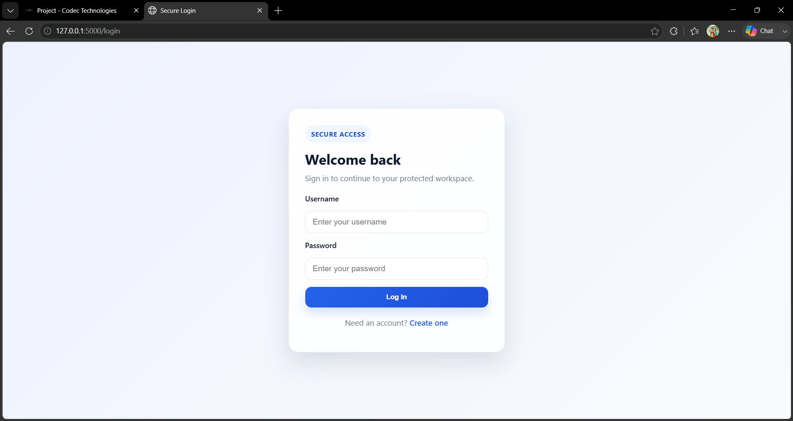
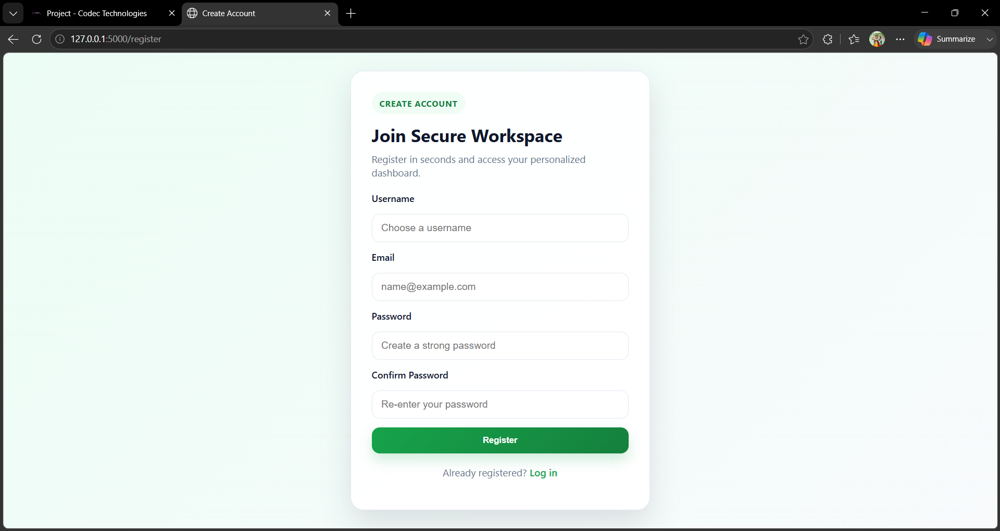
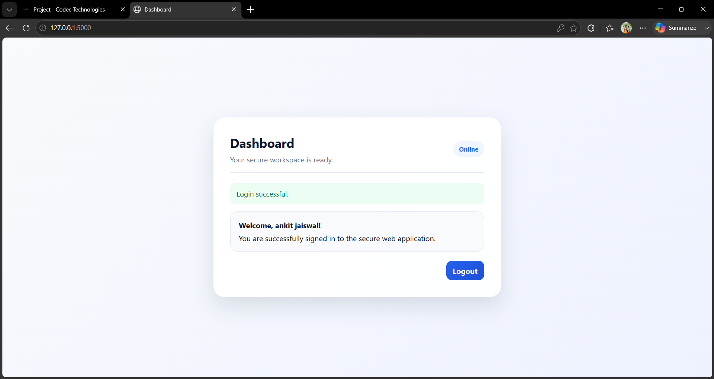

# Secure Web Application

## Objective

This project is a simple yet secure web application built with Python, Flask, SQLite, Flask-Bcrypt, and Flask-Login. It demonstrates user registration, login, session management, password hashing, and basic form validation.

## Tools Used

- Python
- Flask
- SQLite
- Flask-Bcrypt
- Flask-Login
- HTML/CSS

## Features

- User registration with validation
- Secure password hashing using Flask-Bcrypt
- Login and logout functionality with Flask-Login sessions
- Protected dashboard page
- Flash messages for success and error feedback
- Parameterized queries to prevent SQL injection

## How to Run

1. Open a terminal in the project folder.
2. Create and activate a virtual environment:
   - `python -m venv venv`
   - `venv\Scripts\activate`
3. Install dependencies:
   - `pip install -r requirements.txt`
4. Start the application:
   - `python app.py`
5. Open your browser and visit:
   - `http://127.0.0.1:5000/`

## Screenshots

- Login Page:
  

- Registration Page:
  

- Dashboard Page:
  
